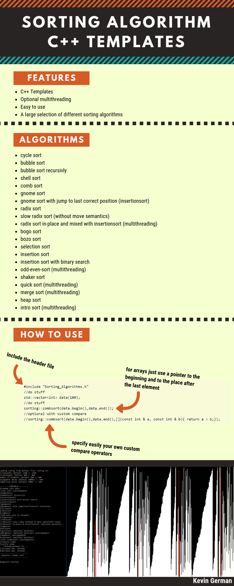

## How to use

```
  #include "Sorting_Algorithms.h"
  //do stuff
  std::vector<int> data(100);
  //do stuff
  sorting::combsort(data.begin(),data.end());
  //optional with custom compare
  //sorting::combsort(data.begin(),data.end(),[](const int & a, const int & b){ return a > b;});
```

This library is used in my other project  [SortVisualization](https://github.com/Kevger/SortVisualization)
